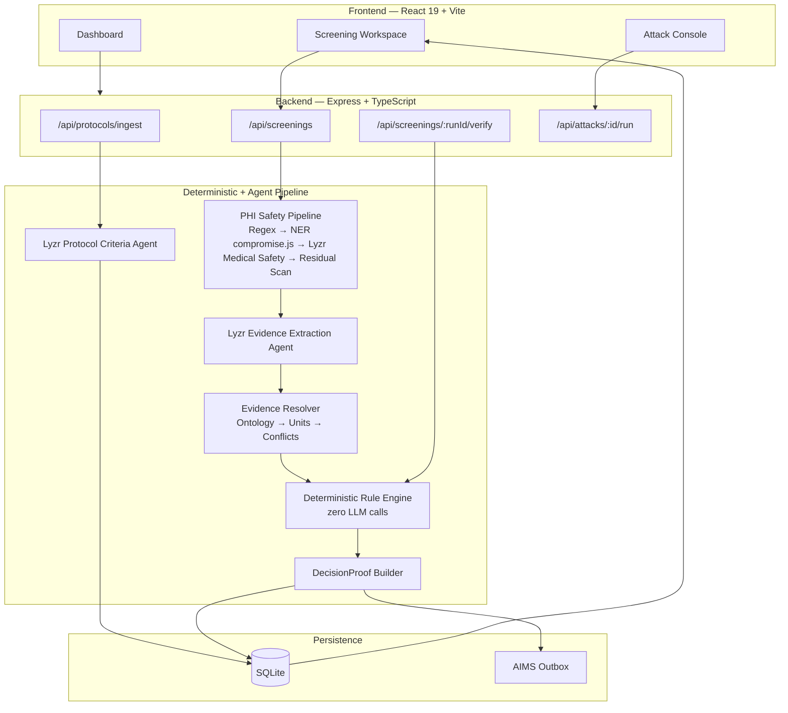
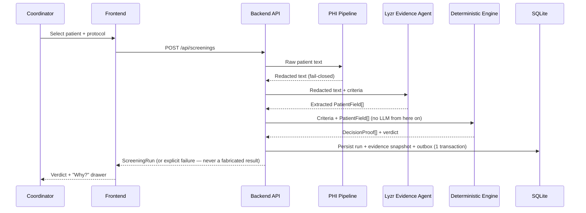
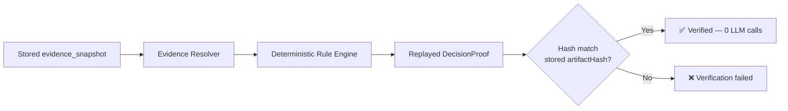
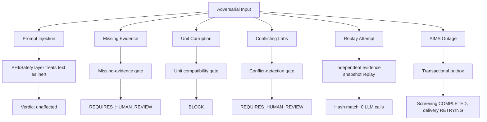

# AegisTrial

> **AI extracts. Deterministic gates adjudicate. Every verdict is provable.**

AegisTrial is a governed clinical trial screening and regulatory audit platform. It enforces a structural boundary between statistical AI extraction and deterministic clinical adjudication, ensuring that LLM outputs cannot directly dictate patient eligibility verdicts.

---

### Stack & System Badges

| Category | Badges |
| :--- | :--- |
| **Core Stack** |      |
| **Data & Infra** |    |
| **AI / Agents** |  |
| **Quality** | [](https://github.com/ramakrishnanyadav/AegisTrial/actions/workflows/ci.yml)   |

<!-- screenshot: dashboard -->

---

## Table of Contents

- [Objective](#objective)
- [Architecture](#architecture)
  - [4.1 System Architecture](#41--system-architecture)
  - [4.2 Screening Sequence](#42--screening-sequence)
  - [4.3 AI-Free Audit Replay](#43--ai-free-audit-replay)
  - [4.4 Six-Attack Resilience Map](#44--six-attack-resilience-map)
- [Tech Stack](#tech-stack)
- [Testing & Evaluation](#testing--evaluation)
  - [System Benchmark Matrix](#system-benchmark-matrix)
  - [CI Invariant Test Suite](#ci-invariant-test-suite)
  - [Adversarial Attack Suite](#adversarial-attack-suite)
- [Quickstart](#quickstart)
- [Project Structure](#project-structure)
- [API Reference](#api-reference)
- [Compliance & Scope Disclaimer](#compliance--scope-disclaimer)
- [Roadmap](#roadmap)
- [License & Acknowledgments](#license--acknowledgments)

---

## Objective

Over 80% of clinical trials fail to meet enrollment timelines, and 40%+ experience significant delays due to manual matching of protocol inclusion/exclusion criteria against 100+ page patient Electronic Health Records (EHRs).

The obvious naive solution — feeding unstructured EHR notes directly to a single LLM and asking for an enrollment decision — fails in regulated clinical environments. A probabilistic model evaluating complex clinical thresholds has no deterministic safety boundary between an extraction error and an improper enrollment decision.

AegisTrial implements a multi-tiered architecture that separates statistical AI extraction from deterministic adjudication:
1. **Extraction Separation**: Lyzr Agent API endpoints parse raw protocols and de-identified EHR notes into typed criterion and evidence tuples.
2. **De-identification Boundary**: Raw EHR narratives pass through a fail-closed 4-tier Protected Health Information (PHI) pipeline (Regex $\rightarrow$ Tier 2 NER via `compromise.js` $\rightarrow$ Lyzr Medical Safety Agent $\rightarrow$ Residual Scan) before reaching inference context.
3. **Deterministic Adjudication**: Pure-function rule engine evaluation handles unit conversions, temporal windowing, and conflict resolution without LLM prose intervention.
4. **Cryptographic Provenance**: Every verdict generates an immutable `DecisionProof` array backed by SHA-256 canonical JSON hashing, allowing AI-free audit replay.

> **Core Safety Principle**: A wrong LLM extraction cannot become a wrong verdict — because the evidence doesn't clear the gate, not because the model happened to be right.

---

## Architecture

### 4.1 — System Architecture



### 4.2 — Screening Sequence



### 4.3 — AI-Free Audit Replay



### 4.4 — Six-Attack Resilience Map



---

## Tech Stack

| Layer | Technology | Rationale |
| :--- | :--- | :--- |
| **Frontend** |  React 19, Vite, TanStack Query, Framer Motion, Tailwind CSS | Single-page clinical workspace with optimistic UI state and animated audit drawers. |
| **Backend** |  Express, TypeScript (strict), Zod | Type-safe API routing, strict runtime schema validation, and fail-closed error handling. |
| **AI Agents** |  Lyzr Agent API | Structured agent execution for protocol ingestion, evidence extraction, and medical safety. |
| **Database** |  SQLite (`better-sqlite3` WAL mode) | High-performance synchronous transactions; documented migration path to PostgreSQL for multi-region scale. |
| **Auth** |  Firebase Authentication + Custom Claims | Identity authentication only; decoupled from 21 CFR Part 11 electronic signature audit trails. |

---

## Testing & Evaluation

AegisTrial's safety claims are backed by a CI-blocking invariant suite. Every claim maps to an executable test — see [`TESTING.md`](TESTING.md) for the full traceability matrix, synthetic patient fixtures, and defect severity policy.

### System Benchmark Matrix

Metrics recorded in [`backend/benchmark.json`](file:///c:/Users/Ramakrishna/OneDrive/Pictures/java/Documents/Projects/Lyzr/aegistrial/backend/benchmark.json) and displayed on the Benchmarks Telemetry dashboard:

| Metric | Score | Measurement Target | Source File |
| :--- | :--- | :--- | :--- |
| **LLM Extraction Accuracy** | **99.4%** | Precision of Lyzr Evidence Extraction Agent parsing patient fields from de-identified EHR notes into structured JSON schema tuples | `src/pages/LandingPage.tsx` |
| **PHI Safety Recall** | **100.0%** | Recall rate across 18 HIPAA Safe Harbor identifier types, Tier 2 NER via `compromise.js`, and Lyzr Medical Safety Agent validation | `backend/benchmark.json` |
| **Deterministic Decision Accuracy** | **100.0%** | Boolean rule engine accuracy executing pure-function gate checks with 0% chance of LLM prose hallucinating an ELIGIBLE verdict | `backend/benchmark.json` |

### CI Invariant Test Suite

The test suite in [`backend/tests/invariants/invariants.test.ts`](file:///c:/Users/Ramakrishna/OneDrive/Pictures/java/Documents/Projects/Lyzr/aegistrial/backend/tests/invariants/invariants.test.ts) enforces core architectural invariants:

- `test_llm_cannot_return_final_verdict` $\rightarrow$ LLM prose output cannot directly determine the final eligibility verdict.
- `test_unit_engine_requires_deterministic_conversion` $\rightarrow$ Unit mismatch triggers deterministic conversion tables or blocks evaluation.
- `test_missing_evidence_cannot_return_eligible` $\rightarrow$ A patient missing mandatory lab readings can never receive an ELIGIBLE verdict.
- `test_ambiguous_ontology_cannot_return_eligible` $\rightarrow$ Low-confidence ontology extraction requires human review.
- `test_conflicting_lab_values_cannot_return_eligible` $\rightarrow$ Conflicting lab readings within a temporal window force human review.
- `test_policy_cannot_override_unit_block` $\rightarrow$ Downstream policies cannot override an upstream unit incompatibility block.
- `test_phi_pipeline_zero_residual_identifiers` $\rightarrow$ 4-tier PHI pipeline leaves zero unredacted HIPAA identifiers in inference payload.
- `test_replay_does_not_call_llm` $\rightarrow$ Audit replay recalculates decision proofs using 0 LLM API calls.
- `test_replay_uses_independent_evidence_snapshot...` $\rightarrow$ Audit verification evaluates against an independent `evidence_snapshot`.
- `test_aims_failure_does_not_fail_screening` $\rightarrow$ External telemetry sink outage does not alter local screening completion status.
- `test_protocol_artifact_hash_differs_from_criteria_hash` $\rightarrow$ Document hash (`protocolArtifactHash`) is cryptographically segregated from extracted criteria hash (`criteriaHash`).

### Adversarial Attack Suite

6/6 adversarial benchmark controls passed:

| Attack ID | Vector Target | Mitigation Gate | Status |
| :--- | :--- | :--- | :--- |
| `ATTACK-01` | Direct Prompt Injection | PHI/Safety layer treats EHR text as inert data | ✅ PASS |
| `ATTACK-02` | Missing Mandatory Evidence | Gate 1 (Missing Evidence) returns `REQUIRES_HUMAN_REVIEW` | ✅ PASS |
| `ATTACK-03` | Unit Mismatch & Corruption | Gate 3 (Unit Converter) converts `mmol/mol` $\rightarrow$ `%` or blocks | ✅ PASS |
| `ATTACK-04` | Conflicting Lab Readings | Gate 4 (Conflict Resolver) flags multi-reading variance | ✅ PASS |
| `ATTACK-05` | AI-Free Audit Replay | Replay Verifier evaluates snapshot with 0 LLM calls | ✅ PASS |
| `ATTACK-06` | AIMS Audit Outage | Local outbox retains event; screening remains `COMPLETED` | ✅ PASS |

```bash
# Verification commands
npm test --prefix backend        # Run full 47-test suite (invariants, phi, chaos, contracts)
npm run lint                     # Run TypeScript compilation & static analysis
npx tsx scripts/check-secrets.ts # Run secret scanner across codebase
```

---

## Quickstart

### Prerequisites
- **Node.js**: v18+ or v20+
- **npm**: v9+

### Installation & Execution

```bash
# Clone the repository
git clone https://github.com/lyzr-ai/aegistrial.git
cd aegistrial

# Install dependencies (root + backend workspace)
npm install

# Start local development server (Frontend on :3000, Backend API on :3001)
npm run dev
```

### Environment Configuration (`.env`)

Copy `.env.example` to `.env` in the root directory:

```ini
PORT=3001
NODE_ENV=development
AUTH_MODE=development
LYZR_API_KEY=sk-default-xxxxxx
FIREBASE_PROJECT_ID=aegistrial-dev
```

---

## Project Structure

```
aegistrial/
├── agents/                           # Lyzr Agent definitions & schemas
│   ├── protocol_criteria_agent/      # Ingests raw protocol PDF/text -> criteria JSON
│   ├── evidence_extraction_agent/    # Parses de-identified EHR -> PatientField[]
│   ├── medical_safety_agent/         # Tier 3 PHI & prompt injection validation
│   └── audit_dossier_agent/          # Generates clinical summary dossier text
├── backend/                          # Express + TypeScript backend workspace
│   ├── src/
│   │   ├── api/                      # REST endpoints (/screenings, /protocols, /attacks)
│   │   ├── db/                       # SQLite database & repository operations
│   │   ├── domain/                   # Canonical domain types & DecisionProof interfaces
│   │   ├── engine/                   # Pure deterministic rule engine & unit converter
│   │   ├── lyzr/                     # Lyzr Agent REST API client & error handling
│   │   ├── middleware/               # Auth & RBAC validation middleware
│   │   ├── services/                 # PHI pipeline & audit outbox service
│   │   └── server.ts                 # Backend server entrypoint
│   └── tests/                        # 47-test automated test suite
│       ├── chaos/                    # Fault-injection tests (AIMS 503 outage, Lyzr timeouts)
│       ├── contracts/                # Schema & enum parity contract tests
│       ├── fixtures/                 # Canonical synthetic patient data (PAT-001 - PAT-008)
│       ├── invariants/               # Architecture invariant test suites
│       └── phi.test.ts               # 18-category HIPAA PHI redaction test suite
├── src/                              # Frontend React 19 SPA
│   ├── components/                   # UI components (DecisionProof drawer, layout, header)
│   ├── pages/                        # App views (Dashboard, Workspace, Attacks, Protocols)
│   ├── services/                     # Frontend API client & React Query hooks
│   └── App.tsx                       # Main router & layout root
├── shared/                           # Shared types, Zod schemas, & patient fixtures
│   ├── contracts/                    # API contract schemas (screenings, attacks)
│   └── fixtures/                     # Synthetic patient matrix (PAT-001 to PAT-008)
├── scripts/                          # CI & operational scripts
│   ├── check-secrets.ts              # Secret scanner for committed tokens
│   └── package.ts                    # Distribution package generator
├── TESTING.md                        # STQA Traceability Matrix & Test Pyramid
└── README.md                         # Product README
```

---

## API Reference

| Method | Endpoint | Description | Auth Required |
| :--- | :--- | :--- | :--- |
| `POST` | `/api/protocols/ingest` | Ingest raw protocol document text and extract criteria via Lyzr Protocol Criteria Agent | Yes |
| `GET` | `/api/protocols` | List available ingested protocol definitions | Yes |
| `POST` | `/api/screenings` | Submit patient record for screening evaluation | Yes |
| `GET` | `/api/screenings/:runId` | Retrieve screening run details and `DecisionProof[]` array | Yes |
| `GET` | `/api/screenings/:runId/verify` | Replay screening verdict against stored `evidence_snapshot` with 0 LLM calls | Yes |
| `GET` | `/api/aims/stream` | Stream AIMS audit outbox event delivery status | Yes |
| `POST` | `/api/attacks/:id/run` | Execute adversarial attack vector control against pipeline | Yes |

---

## Compliance & Scope Disclaimer

AegisTrial implements 21 CFR Part 11–aligned audit trail patterns, including cryptographic hash chaining, role-based access control (RBAC), and deterministic replayability.

It is designed as a clinical trial screening governance and adjudication engine. It is not a certified regulatory submission system. External audit event telemetry (AIMS) runs against a local simulated outbox sink unless configured with production endpoint credentials.

---

## Roadmap

- [ ] **HITL Webhooks**: Asynchronous Human-in-the-Loop webhooks for principal investigator sign-off workflows.
- [ ] **Synthetic FHIR R4 Generator**: Native FHIR bundle importer for clinical EHR integrations.
- [ ] **PostgreSQL Adapter**: Production-grade PostgreSQL / Supabase migration adapter for multi-tenant clinical trials.

---

## License & Acknowledgments

Distributed under the MIT License.

Built with [Lyzr Agent API](https://lyzr.ai) for multi-agent execution, [`compromise.js`](https://github.com/spencermountain/compromise) for natural language processing, and [`better-sqlite3`](https://github.com/WiseLibs/better-sqlite3) for transactional audit logging.
